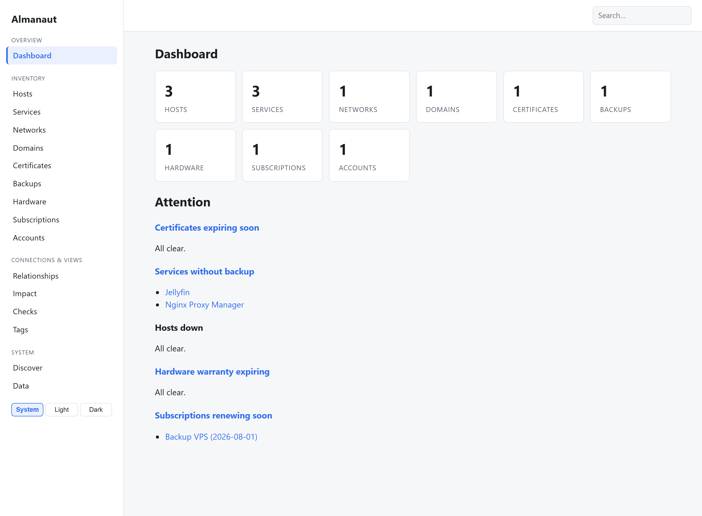
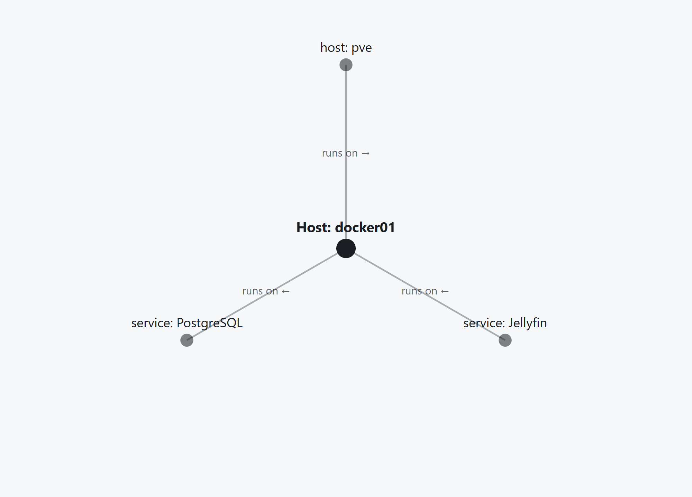
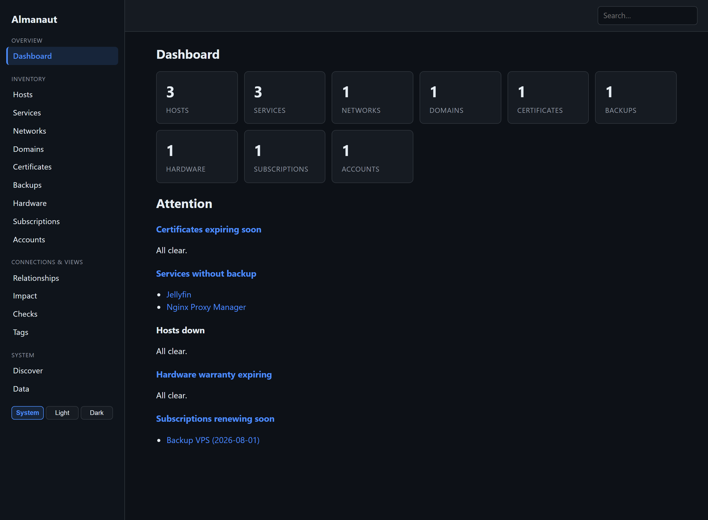

# Almanaut

[](https://github.com/Dealisto/almanaut/actions/workflows/ci.yml)
[](LICENSE)
[](https://github.com/Dealisto/almanaut/pkgs/container/almanaut)

A lightweight, self-hosted homelab inventory & documentation tool.
"NetBox for the rest of us."

> Status: early development (v0.1).

## Contents

- [What it does](#what-it-does)
- [Screenshots](#screenshots)
- [Run with Docker](#run-with-docker)
- [Run with Docker Compose](#run-with-docker-compose)
- [Run from source](#run-from-source)
- [Configuration](#configuration)
- [Export & import](#export--import)
- [JSON API](#json-api)
- [Metrics](#metrics)
- [Health & version](#health--version)
- [Auto-discovery](#auto-discovery)
- [License](#license)

## What it does

Almanaut is a single Go binary (SQLite storage, server-rendered UI, no
client-side JS framework) for keeping track of your homelab. It tracks nine
entity types and the relationships between them:

- **Hosts** — physical machines, VMs, LXC containers, and VPSes
- **Services** — the things running on your hosts
- **Networks** — subnets, with built-in IPAM (usage, capacity, next-free IP)
- **Domains** — DNS names / FQDNs
- **Certificates** — TLS certs with expiry tracking
- **Backups** — what's backed up, from where
- **Hardware** — devices with warranty tracking
- **Subscriptions** — recurring services with renewal dates
- **Accounts** — logins and secret references

On top of the inventory you get:

- **Relationships & a neighbourhood graph** on each detail page (e.g. a service
  *runs on* a host, *is backed up by* a backup)
- **Global search** across every entity type
- **A dashboard** summarising your inventory and what's expiring soon
- **Auto-discovery** from Docker, a network subnet scan, and Proxmox VE
- **Expiry notifications** via [ntfy](https://ntfy.sh) for certs, warranties,
  and renewals
- **A read-only JSON API** and a Prometheus **`/metrics`** endpoint
- **YAML export/import** of the entire inventory
- **Optional HTTP Basic auth** for when a trusted LAN isn't enough

## Screenshots

**Dashboard** — inventory totals and what's expiring soon, with the grouped
sidebar navigation:



**Relationship graph** — each entity's neighbourhood is drawn on its detail
page (here, a host with the VM it runs on and the services running on it):



**Dark mode** — a built-in System / Light / Dark switch; System follows your OS:



## Run with Docker

```bash
docker run --rm -p 8080:8080 -v almanaut-data:/data ghcr.io/dealisto/almanaut:dev
```

Then open http://localhost:8080.

Images are published to GHCR automatically: `:dev` tracks `master`, and a
tagged release (`vX.Y.Z`) publishes `:X.Y.Z`, `:X.Y`, and `:latest`. Images are
multi-arch (`linux/amd64` and `linux/arm64`).

The container runs as a non-root user (uid `65532`). A fresh named volume (as
above) inherits the right ownership automatically. If you instead bind-mount a
host directory (`-v /host/path:/data`), make it writable by that uid first —
`sudo chown 65532:65532 /host/path` — otherwise the database cannot be created.

## Run with Docker Compose

Drop this into `docker-compose.yml` and run `docker compose up -d`:

```yaml
services:
  almanaut:
    image: ghcr.io/dealisto/almanaut:dev
    container_name: almanaut
    ports:
      - "8080:8080"
    volumes:
      - almanaut-data:/data
      # Uncomment to enable Docker container auto-discovery (read-only):
      # - /var/run/docker.sock:/var/run/docker.sock:ro
    environment:
      # All optional — see the Configuration table below. A few common ones:
      # ALMANAUT_AUTH_USER: admin
      # ALMANAUT_AUTH_PASS: change-me
      # ALMANAUT_ENABLE_NETWORK_SCAN: "true"
      # ALMANAUT_NTFY_URL: https://ntfy.sh/my-homelab
      TZ: Etc/UTC
    restart: unless-stopped

volumes:
  almanaut-data:
```

Then open http://localhost:8080. The image ships its own `HEALTHCHECK`, so
`docker compose ps` reports the container's health directly.

## Run from source

```bash
go build -o almanaut .
ALMANAUT_DATA_DIR=./data ./almanaut
```

## Configuration

| Variable                      | Default              | Description                                    |
|-------------------------------|----------------------|------------------------------------------------|
| `ALMANAUT_ADDR`               | `:8080`              | TCP listen address                             |
| `ALMANAUT_DATA_DIR`           | `./data`             | Directory for the SQLite database              |
| `ALMANAUT_DOCKER_SOCKET`      | `/var/run/docker.sock` | Path to the Docker socket for auto-discovery |
| `ALMANAUT_ENABLE_NETWORK_SCAN` | `false`              | Enable the opt-in subnet scan                  |
| `ALMANAUT_SCAN_SUBNET`        | (empty)              | Default subnet (CIDR) pre-filled in the scan form |
| `ALMANAUT_PROXMOX_URL`        | (empty)              | Proxmox VE API base URL (e.g. `https://pve.lan:8006`); enables Proxmox discovery when set with a token |
| `ALMANAUT_PROXMOX_TOKEN`      | (empty)              | Proxmox API token (`user@realm!tokenid=secret`) |
| `ALMANAUT_PROXMOX_INSECURE`   | `false`              | Skip TLS verification for a self-signed Proxmox certificate |
| `ALMANAUT_AUTH_USER`          | (empty)              | Username for optional HTTP Basic auth; enables auth when set together with `ALMANAUT_AUTH_PASS` |
| `ALMANAUT_AUTH_PASS`          | (empty)              | Password for optional HTTP Basic auth |
| `ALMANAUT_SECURE_COOKIES`     | `false`              | Force the `Secure` flag on cookies; set to `true` when serving HTTPS through a TLS-terminating reverse proxy |
| `ALMANAUT_NTFY_URL`           | (empty)              | ntfy topic URL for expiry alerts (e.g. `https://ntfy.sh/my-homelab`); empty disables notifications |
| `ALMANAUT_NTFY_TOKEN`         | (empty)              | Optional bearer token for a protected ntfy topic (supports the `_FILE` convention) |
| `ALMANAUT_NOTIFY_WITHIN_DAYS` | `30`                 | Days ahead to treat certificates/warranties/renewals as "expiring soon" |
| `ALMANAUT_NOTIFY_INTERVAL`    | `24h`                | How often the notifier checks (Go duration, e.g. `12h`) |

### Secrets from files

The two sensitive values — `ALMANAUT_AUTH_PASS` and `ALMANAUT_PROXMOX_TOKEN` —
can instead be read from a file by appending `_FILE` to the variable name and
pointing it at the file (`ALMANAUT_AUTH_PASS_FILE=/run/secrets/auth_pass`). This
keeps the secret out of the process environment, where it would otherwise be
visible via `docker inspect`, `/proc`, or inherited by child processes. It pairs
directly with [Docker secrets](https://docs.docker.com/engine/swarm/secrets/) and
Kubernetes secrets, which are mounted as files. The `_FILE` variant takes
precedence over the plain variable, and a single trailing newline is stripped.

When `ALMANAUT_AUTH_USER` and `ALMANAUT_AUTH_PASS` are both set, every page
requires those credentials via HTTP Basic auth. When either is unset, Almanaut is
unauthenticated and intended for a trusted LAN or an authenticated reverse proxy.
Basic auth transmits credentials base64-encoded (not encrypted), so terminate TLS
in front of Almanaut when exposing it beyond localhost. Almanaut also does not
rate-limit or lock out failed logins, so do not expose it directly to the
internet — keep it behind a reverse proxy (which can add throttling and TLS) or a
VPN.

Note that `/export` returns the **entire inventory**, including account entries
(usernames, password-manager names, and secret references). In the default
unauthenticated mode anyone who can reach the server can download it, so enable
auth (or an authenticated reverse proxy) before storing anything sensitive.

### Behind a reverse proxy (TLS)

Almanaut serves plain HTTP with no built-in TLS or rate limiting, so put a
reverse proxy in front for anything beyond localhost. Whatever proxy you use,
set `ALMANAUT_SECURE_COOKIES=true` so cookies get the `Secure` flag once TLS is
terminated upstream.

**Caddy** — automatic Let's Encrypt TLS in two lines (`Caddyfile`):

```caddyfile
almanaut.example.com {
    reverse_proxy almanaut:8080
}
```

**Traefik** — as labels on the `almanaut` service in your `docker-compose.yml`:

```yaml
    labels:
      - "traefik.enable=true"
      - "traefik.http.routers.almanaut.rule=Host(`almanaut.example.com`)"
      - "traefik.http.routers.almanaut.entrypoints=websecure"
      - "traefik.http.routers.almanaut.tls.certresolver=le"
      - "traefik.http.services.almanaut.loadbalancer.server.port=8080"
```

### Expiry notifications

Set `ALMANAUT_NTFY_URL` to an [ntfy](https://ntfy.sh) topic URL and almanaut
pushes a notification when a certificate, hardware warranty, or subscription
renewal falls within `ALMANAUT_NOTIFY_WITHIN_DAYS` (default 30). Each item
notifies **once**; renewing it (pushing the date beyond the window) re-arms it
for next time. The check runs at startup and every `ALMANAUT_NOTIFY_INTERVAL`.
Leave `ALMANAUT_NTFY_URL` unset to disable notifications entirely.

## Export & import

The whole inventory round-trips through a single YAML file. **Data → Export**
(or `GET /export`) downloads `almanaut-export.yaml`; **Data → Import** uploads
one back. This is your backup/restore and migration path.

> ⚠️ Import **replaces the entire inventory** — every existing record is
> deleted and re-created from the file. It is not a merge. The import form
> makes you tick a confirmation checkbox first.

### Try it with sample data

Want to see the app populated before entering your own data? This repo ships a
small example homelab (three hosts, some services, a network, a certificate, a
backup, and the relationships between them). Grab
[`examples/inventory.yaml`](examples/inventory.yaml), then go to **Data →
Import**, upload it, tick the confirmation box, and import. You'll land on a
populated dashboard with a browsable relationship graph.

Since import wipes existing data, only load the sample into a fresh instance
(or export your real data first).

## JSON API

A read-only JSON API mirrors the inventory for scripts and dashboards. It sits
behind the same optional Basic auth as the UI (open when auth is unset).

| Endpoint | Returns |
|---|---|
| `GET /api/{type}` | All entities of a type (e.g. `/api/hosts`, `/api/hardware`, `/api/certificates`) |
| `GET /api/{type}/{id}` | One entity, or `404 {"error":"…"}` if absent |
| `GET /api/search?q=<term>` | Flat array of matches: `[{"type","id","label","path"}]` |
| `GET /api/relationships` | All relationships |

Field names match the YAML export (snake_case). Responses are
`application/json`. The API is read-only (GET); use the web UI to make changes.

```bash
curl -s http://localhost:8080/api/certificates | jq '.[] | {subject, expires_on}'
```

## Metrics

`GET /metrics` exposes aggregate inventory gauges in the Prometheus text format,
behind the same optional Basic auth as the rest of the app (configure
`basic_auth` in your Prometheus scrape job if auth is enabled).

| Metric | Meaning |
|---|---|
| `almanaut_entities_total{type="…"}` | Count of each entity type |
| `almanaut_relationships_total` | Number of relationships |
| `almanaut_certificates_expiring_total` | Certificates expiring within 30 days |
| `almanaut_hardware_warranty_expiring_total` | Warranties expiring within 30 days |
| `almanaut_subscriptions_renewal_due_total` | Renewals due within 30 days |
| `almanaut_hosts_down_total` | Hosts marked down/offline/stopped |
| `almanaut_services_without_backup_total` | Services with no backup relationship |

```bash
curl -s http://localhost:8080/metrics
```

## Health & version

Two unauthenticated endpoints are always available (they bypass basic auth so
probes can reach them):

| Endpoint    | Response                                                        |
|-------------|-----------------------------------------------------------------|
| `/healthz`  | `200 ok` when the database is reachable, `503` otherwise         |
| `/version`  | `{"version":"..."}` — the build version (`dev` for local builds) |

The Docker image ships a `HEALTHCHECK` that runs `almanaut healthcheck`, a
built-in subcommand that probes the local `/healthz` and exits non-zero when
unhealthy (the distroless image has no shell, so the binary is its own probe).

To stamp a version into a build, pass it at build time:

```bash
# from source
go build -ldflags "-X main.version=v0.2.0" -o almanaut .

# Docker
docker build --build-arg VERSION=v0.2.0 -t almanaut .
```

## Auto-discovery

To enable Docker container discovery, mount the Docker socket read-only into the container:

```bash
docker run --rm -p 8080:8080 -v almanaut-data:/data -v /var/run/docker.sock:/var/run/docker.sock:ro ghcr.io/dealisto/almanaut:dev
```

If your Docker socket is at a non-standard path, override it with the `ALMANAUT_DOCKER_SOCKET` environment variable.

Then navigate to **Discover → Docker containers** to scan for containers. Optionally select a host, choose the containers you want to import, and they will be created as Services with an automatic "runs on" relationship to the selected host. Discovery only reads from the socket and creates new Services—it never overwrites your manual data.

### Network scan

To enable network subnet scanning, set `ALMANAUT_ENABLE_NETWORK_SCAN=true`. Optionally set `ALMANAUT_SCAN_SUBNET` to pre-fill the subnet in the scan form.

Then navigate to **Discover → Network scan**, enter a subnet (CIDR) and optional ports, click Scan, pick a host type, select the hosts you want to import, and they will be created. The scan is a lightweight pure-Go TCP-connect probe (a host is considered "live" if at least one probed port is open). Network discovery only ever creates new Hosts and never overwrites your manual data. Subnets larger than 1024 hosts are rejected.

### Proxmox

To enable Proxmox discovery, set both `ALMANAUT_PROXMOX_URL` (e.g. `https://pve.lan:8006`) and `ALMANAUT_PROXMOX_TOKEN`. The token must be a Proxmox API token with read access. To create one:

1. Log in to your Proxmox VE web interface
2. Navigate to **Datacenter → Permissions → API Tokens**
3. Click **Add**
4. Choose a user (e.g. `root`) and token ID
5. Assign the **PVEAuditor** role (or equivalent read-only role) to the token
6. Copy the token in the format `user@realm!tokenid=secret` and set it as `ALMANAUT_PROXMOX_TOKEN`

If your Proxmox server uses a self-signed certificate (the default), set `ALMANAUT_PROXMOX_INSECURE=true` to skip TLS verification.

Then navigate to **Discover → Proxmox**, review the discovered resources, optionally keep "Link VMs/LXC to their Proxmox node" checked to create "runs on" relationships, select what to import, and click Import. Proxmox nodes are imported as `physical` hosts, QEMU VMs as `vm` hosts, and LXC containers as `lxc` hosts. Proxmox discovery only reads and only ever creates new Hosts—it never overwrites your manual data.

## License

MIT (see LICENSE).
