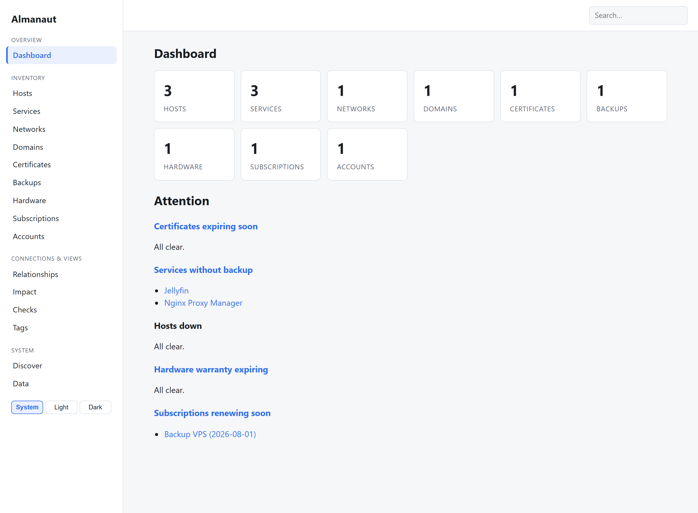
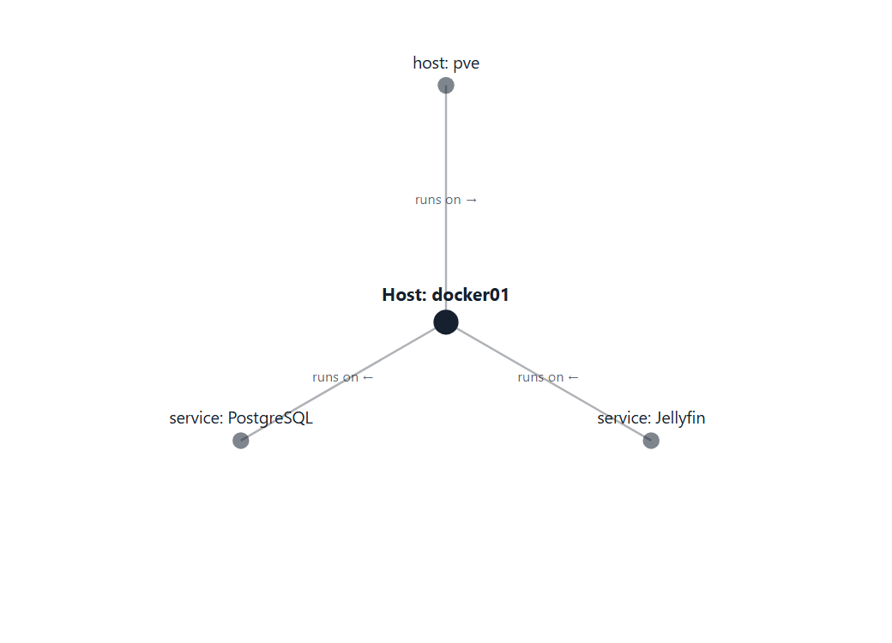
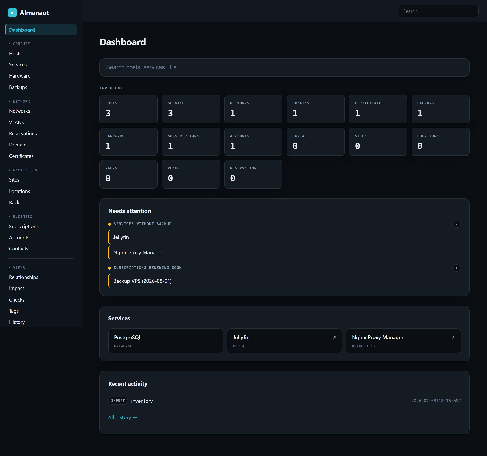

<div align="center">

# Almanaut

**A lightweight, self-hosted homelab inventory & documentation tool.**
*"NetBox for the rest of us."*

[](https://github.com/Dealisto/almanaut/actions/workflows/ci.yml)
[](LICENSE)
[](https://github.com/Dealisto/almanaut/pkgs/container/almanaut)

One Go binary · SQLite storage · server-rendered UI · zero client-side JS frameworks



</div>

Almanaut keeps track of everything in your homelab — machines, services,
networks, certificates, backups, subscriptions, and how they all relate — in
one place, with the operational extras that usually require three more tools:
IPAM, expiry alerts, auto-discovery, a JSON API, and Prometheus metrics.

It is deliberately small: a single binary, a single SQLite file, and a
server-rendered UI. Back it up by copying one file (or one YAML export).

> **Status:** stable — **v1.0.0** is released. The NetBox-parity and
> automation/quality/security roadmap (M1–M9) is complete: RBAC, TOTP 2FA,
> reverse-proxy SSO, an audit log, live liveness/TLS probing, scheduled
> discovery, inventory-health reports, an OpenAPI 3 spec, and versioned
> releases all shipped. See [CHANGELOG.md](CHANGELOG.md) for what's in each
> release; the export/import path keeps upgrades and migrations safe.

## Features

**Inventory**

- **15 entity types** — hosts, services, networks, domains, certificates,
  backups, hardware, subscriptions, accounts, sites, locations, racks,
  contacts, VLANs, and IP reservations
- **Relationships & a neighbourhood graph** on every detail page (a service
  *runs on* a host, *is backed up by* a backup, *administered by* a contact…)
- **Global search** across every entity type, tags, and custom-field values
- **Dashboard** with a "needs attention" panel, inventory summary, and recent
  activity
- **Custom fields** — add your own typed fields (text, number, bool, date) to
  any entity type
- **Attachments** — upload files (manuals, invoices, configs) to any entity
- **Tags** on everything, **journal** notes, and an automatic field-level
  **change history** per entity plus a global `/history` feed

**Networking & physical layout**

- **IPAM** — per-network usage, capacity, next-free IP, VLANs, and named IP
  reservations (DHCP pools, reserved blocks)
- **Sites → locations → racks** hierarchy, with a rendered **U elevation** for
  each rack showing its occupants at their positions

**Automation & integrations**

- **Auto-discovery** from Docker (via the socket), a network subnet scan, and
  Proxmox VE — discovery only ever *creates* records, never overwrites yours
- **Expiry notifications** via [ntfy](https://ntfy.sh) and/or Discord for
  certificates, warranties, and renewals
- **Outbound webhooks** — signed HTTP payloads on entity create/update/delete
- **Uptime Kuma sync** — one-way sync of your services to Kuma HTTP monitors
- **Read-write JSON API** with per-user, scoped API tokens, a built-in
  reference page, and a generated OpenAPI 3 spec
- **Prometheus `/metrics`** endpoint

**Operations**

- **Mandatory login** with **role-based access control** (admin / editor /
  viewer), per-username login throttling, and session-cookie auth
- **TOTP two-factor authentication** with single-use recovery codes,
  **reverse-proxy SSO**, and an **authentication audit log**
- **Inventory health report** with fixed audit rules, IPAM conflict detection,
  stale-entity tracking, and **impact analysis**
- **Filter, sort and save views** per user; **bulk actions** on list pages
- **Live checks** — TCP liveness for hosts and services, TLS certificate
  probing, and scheduled discovery runs, all on one scheduled-tasks page
- **YAML export/import** of the whole inventory, plus additive per-entity
  **CSV import**
- **Dark mode** (System / Light / Dark), Docker `HEALTHCHECK`, multi-arch
  images (`amd64` / `arm64`), distroless non-root container

## Screenshots

**Relationship graph** — each entity's neighbourhood is drawn on its detail
page (here, a host with the VM it runs on and the services running on it):



**Dark mode** — a built-in System / Light / Dark switch; System follows your OS:



## Quick start

```bash
docker run --rm -p 8080:8080 -v almanaut-data:/data ghcr.io/dealisto/almanaut:dev
```

Open http://localhost:8080 and log in with the admin credentials printed in the
container log. That is the thirty-second version; the
[installation guide](docs/installation.md) covers Docker Compose, prebuilt
binaries, building from source, the first-login flow, and loading the sample
inventory.

## Documentation

The full documentation lives in [`docs/`](docs/README.md):

| Page | What's in it |
|---|---|
| [Installation](docs/installation.md) | Docker, Compose, prebuilt binaries, from source, first login, sample data |
| [Configuration](docs/configuration.md) | Every environment variable, secrets from files, reverse proxy & TLS, the security model |
| [Authentication & access control](docs/authentication.md) | Roles, sessions, login throttling, lockout recovery, TOTP 2FA, reverse-proxy SSO, the audit log |
| [The inventory model](docs/inventory-model.md) | The 15 entity types, sites/locations/racks, IPAM, custom fields, attachments, history |
| [Lists, saved views & bulk editing](docs/lists-and-views.md) | Filtering and sorting, saved views, bulk actions on list pages |
| [Inventory health](docs/inventory-health.md) | The health report and its audit rules, stale entities, the checks page, impact analysis |
| [Auto-discovery](docs/discovery.md) | Docker containers, network scan, Proxmox VE |
| [Inventory agent](docs/agent.md) | Installing `almanaut-agent`, what it reports, conflicts and duplicates |
| [Background jobs](docs/background-jobs.md) | The scheduled-tasks page, liveness checks, certificate probing, scheduled discovery |
| [Notifications & integrations](docs/integrations.md) | ntfy & Discord expiry alerts, outbound webhooks, Uptime Kuma sync |
| [Export & import](docs/export-import.md) | Whole-inventory YAML round-trip, additive CSV import |
| [JSON API](docs/api.md) | Tokens and scopes, endpoints, the OpenAPI 3 spec |
| [Monitoring](docs/monitoring.md) | Prometheus metrics, `/healthz`, `/version` |

## License

[MIT](LICENSE)
